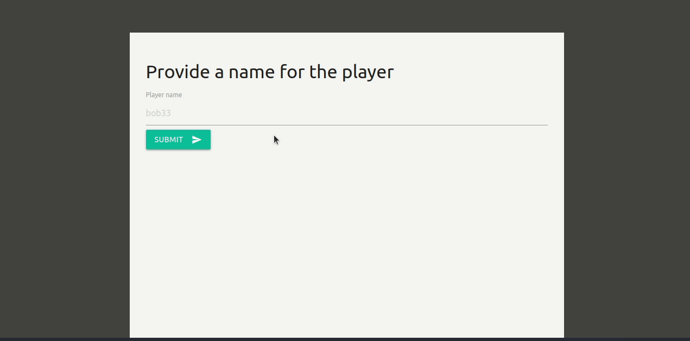

# Platform Game

### [live demo](https://platform-game.santiagorodriguez.dev)

A game built with [Phaser 3](http://phaser.io/), you can see in the source code
how to create several scenes for a general purpose game, the only part of the
game that makes it a platform game is the `GameScene`, what does it mean? It
means that if you instead wanted to build a space shooter game, there's nothing
to stop you! Just reuse the remaining scenes (all but the `GameScene`), how
amazing is that!?



## Features

- Assets loading scene (a progress bar)
- Title scene (a menu with buttons)
- Options scene (gives the possibility to turn off the music)
- Leader board scene (a scores board)
- An endless runner game (it has platforms so it is a platform game too)

## Requirements

- [node](https://nodejs.org/en/)
- npm (it already comes with node)

## Setup

1. Clone the repository

```sh
git clone https://github.com/santiago-rodrig/platform-game.git
```

2. Change directory

```sh
cd platform-game
```

3. Install dependencies

```sh
npm install
```

Now, in order to take a look you can use one the tasks provided called
**server**, type inside of your terminal `npm run server` and a local server
will fire up, now visit [localhost:8080](http://localhost:8080) and watch
the application running.

If you don't trust that everything works properly you can run the **tests**
for this application (only helper functions are being tested for several
reasons) by issuing the following command: `npm test`.

## How was the developing process?

1. Planned the player mechanics (what can the player do)
2. What assets should the game use?
3. Conceive the platforms automatic generation
4. Define the scoring rules
5. Set up the difficulty changes once some time has elapsed already
6. Create the collectable items and decide when to increment their value
7. Settle the obstacles along the gameplay
8. Make the game over available options
9. Implement a scoring system that tracks all players' scores

Nine steps (some took more time to implement than others), but actually it is
not too much.

## License

This project is subject to the [MIT](./LICENSE) license, which
basically means that you can do whatever you want with the code under the
condition of giving credit to its author and noticing the license.

## Credits

This application was developed by
[santiago-rodrig](https://github.com/santiago-rodrig).

## Contact

You can reach me out at the following URLs

- [Github](https://github.com/santiago-rodrig)
- [LinkedIn](https://www.linkedin.com/in/santiago-andres-rodriguez-marquez)
- [AngelList](https://angel.co/u/santiago-andres-rodriguez-marquez)
- [santo1996.29@gmail.com](mailto:santo1996.29@gmail.com)
